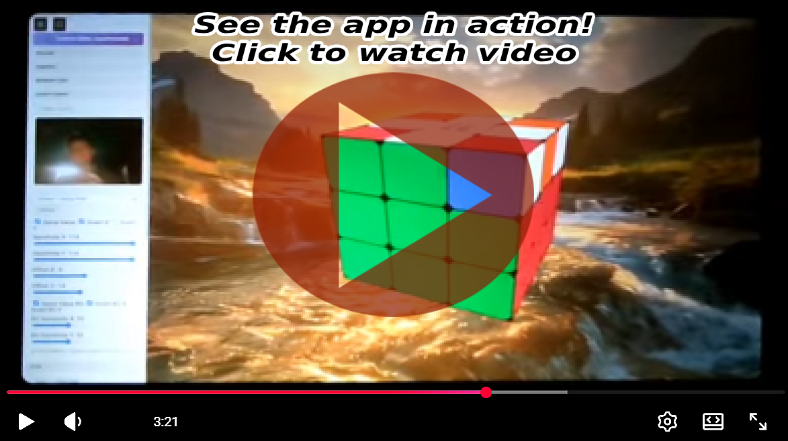
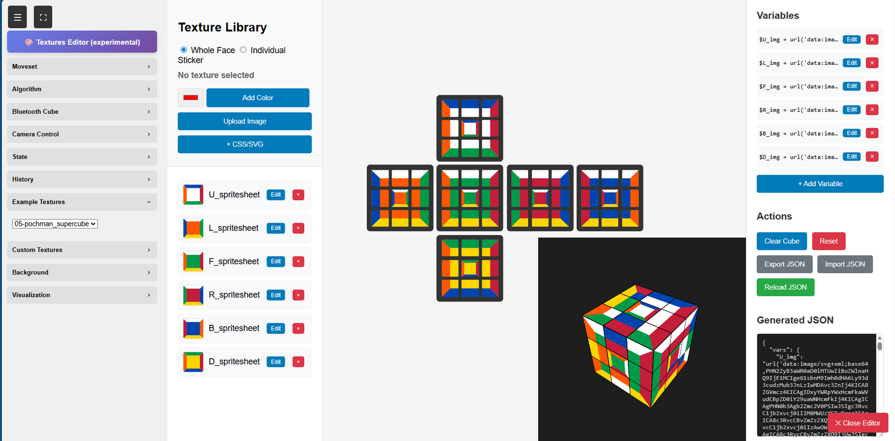
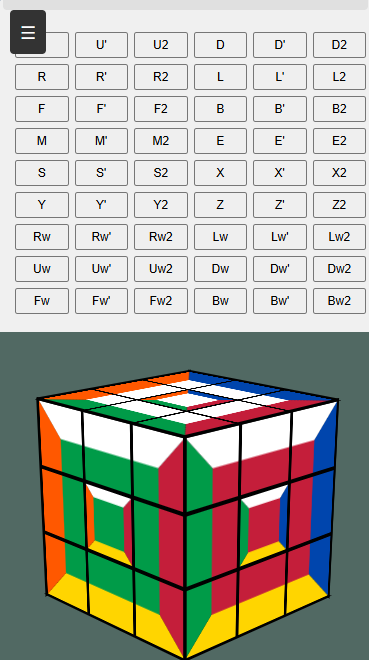

# Picture Cube

A 3D Rubik's cube simulator with custom texture support and multiple visualization modes.

[](https://www.youtube.com/watch?v=OOUIykqF7zs)





## Setup

```bash
git clone https://github.com/shuantsu/picture_cube.git
cd picture-cube
php -S localhost:8000 -t dist/
```

## Features

- Interactive 3D cube with mouse/touch controls
- Algorithm execution (standard notation)
- Custom texture system with JSON configuration
- Multiple view modes (2D net, 3D orthographic, 3D perspective)
- Example texture presets included

## Live Demo

https://filipeteixeira.com.br/new/picturecube/

## Usage

Open `localhost:8000` in your browser. Use the control panel to:
- Execute moves manually or via algorithm input
- Apply custom textures via JSON configuration
- Switch between visualization modes
- Load example texture configurations

Supports standard cube notation (R, U, F, L, B, D) with modifiers (', 2) and advanced moves (M, E, S, x, y, z, wide moves).